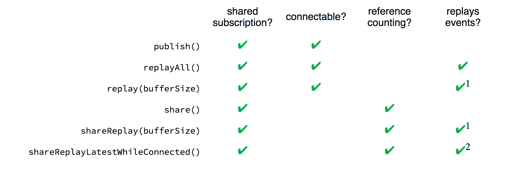

# RxSwift

**RX**

**Operatörler**

[**http://reactivex.io/documentation/operators.html#combining**](http://reactivex.io/documentation/operators.html#combining)

-   combineLatest -> 2 veya daha fazla, farklı veya aynı tipte observable’ın **içlerinden birinin değişmesi durumunda** kombine şekilde **aynı anda** döndürülmesi (Başlangıçta ikisininde değişmesi gerekir.)

-   withLatestFrom -> CombineLatest ile aynı fakat bunda 2. değerin değişmesinde değil sadece 1. değerin değişmesi durumunda yayın yapılır. 2. değerin ise son değeri verilir. (Başlangıçta ikisininde değişmesi gerekir.)

-   Merge -> 2 veya daha fazla aynı tipte olan observable’ın merge’lenip **bir tanesi değiştikçe tek bir değer şeklinde** anlık olarak sırayla döndürülmesi (Yani tek observable gibi davranması) (başlangıçta 1 tanesinin değişmesi yeterli)

-   Zip -> 2 veya daha fazla, farklı veya aynı tipte observable’ın ziplenerek, **her ikisinin de değerinin değiştiği** durumda **aynı anda** döndürülmesi (sırasıyla gelir bkz [http://reactivex.io/documentation/operators/zip.html](http://reactivex.io/documentation/operators/zip.html)) Başlangıçta ikisininde değişmesi gerekir.)

-   amb -> ilk gelen observer kapar. Diğerlerini dinlemez.

-   Concat -> Önce ilk observable'ın verileri sonra ikinci.

-   flatMap -> içerisinde tanımlanan Observable’a map eder. bağlı olduğu observable her tetiklendiğinde, içinde tanımlanan observable’dan 1 tane daha oluşur. Örnek: flatMap içinde Timer varsa bağlı olduğu observable’a her yeni event geldiğinde yenisi yani +1 timer daha eklenecek böylelikle 1’den fazla timer oluşmuş olacak. (First ve latest katılan yeni observable’lara göre ilkini veya son geleni kullanmaya yarıyor)

-   flatMapLatest -> içerisinde tanımlanan Observable’a map eder. Örnek: flatMap içinde Timer varsa bağlı olduğu observable’a yeni event geldiğinde bir önceki dispose olur. böylelikle dublicate olmaz.

-   throttle -> due time gelince son değeri basar

-   debounce -> due time değer değiştikçe resetlenir. 

-   distinctUntilChanged -> Dublicate’i önler. Sadece değer değiştiğinde iletir. 

-   startWith -> emit etmeden önce manuel bir değer göndermek için

-   share -> SharingStrategy’i belirlemek için kullanılan operatördür. her listener için tek bir bağlantı mı yoksa çoklu bağlantı mı oluşturulacağı konusunda davranışı ayarlar. Örnek: X observable’ı var ve 3 tane ayrı ayrı dinleyen sequence var. 3’ü için ayrı ayrı emit edebilir. o yüzden share ile hepsine tek bağlantı ayarlanması sağlanabilir.(.whileConnected) veya ayrı ayrı yapılabilir.(.forever) (replay ile son değerden kaç tanesi korunacağı girilebilir. böylece her yeni bağlantı kurulduğunda son değer dinlenebilir.)

(ESKİ AÇIKLAMA: Her bir bağlantıda sequence oluşur ve completed atar. sonra tekrar bağlanılır ve tekrar completed atar. (davranışı vs için parametreler kullanılır.) (replay:  subscribe olunduğunda, subscription öncesinde gelen değerlerden en son kaç tanesinin observer’a verileceği belirlenir, scope:  .whileConnected(her bir observer connection’ı için farklı _subject_’ler oluşur. her bağlantı birbirinden izoledir.), .forever(tek bir subject vardır. bağlantılar izole değildir tek bir bağlantı gibi davranılır.) (bkz: SubjectLifetimeScope)))

-   Operatörler kendileri main thread’te serial bir şekilde çalışırlar. Fakat kendimiz yönlendirebiliriz. Request attığında ise otomatik olarak ayrı bir thread’te çalışır. Bind gibi drive gibi operatörler ise otomatik şekilde main thread’e aktarırlar.
-   scan: **swift’teki** reduce gibi çalışır iterasyon ile önceki değer ve yeni değer ile toplama, çarpma vs gibi bir mantık ile manuplasyona fırsat verir. ve tek tek döner
-   reduce scanin aynısıdır fakan sequence dispose olduğunda sadece son değeri verir.

Schedular
-   subscribeOn -> subscription işleminde.
-   observedOn -> Kalıcı olarak eventlerin koşacağı threadi belirler.

-   **MainScheduler**: Bu zamanlayıcı genellikle **UI** işlemlerinde kullandığımız main thread zamanlayıcısıdır.
-   **CurrentThreadScheduler**: Default olarak kullanılan zamanlayıcı.
-   **SerialDispatchQueueScheduler**: Eşzamanlı bir gönderme kuyruğu geçse bile, seri bir haale dönüştüren zamanlayıcı.
-   **ConcurrentDispatchQueueScheduler**:  Bazı işlerin arka planda yapılması gerektiğinde uygun olan zamanlayıcı.
-   **OperationQueueScheduler**: Bu zamanlayıcı, arka planda yapılması gereken bazı büyük iş parçalarının olduğu durumlarda ve maxConcurrentOperationCount kullanılarak eşzamanlı işleme ince ayar yapmak istediğiniz durumlarda uygun olan zamanlayıcı.
- 
**Queue**
-   Queue’lar Thread’leri kullanarak çalışır. İş listesi olarak düşünülebilir. Bir thread’te farklı queue’lar olabilir. Örn Sync bir şekilde main thread’te queue oluşturulabilir. 
-   Hem yeni queue hem de Async kullanmadıkça yeni thread oluşmaz.

**Traits**

-   Single -> Tek bir obje veya hata
-   Completable -> Sadece tamamlandı veya hata oluştu bilgisi
-   Maybe -> Single ve Completable karışımı, bir element, completion veya bir hata, Bir element paylaşabilir ama paylaşmasını gerektirmeyen durumlarda olabilirse kullanılır.

**Tanım**

-   Observable -> (Gözlemlenebilir) Yayım yapan yapılar. Bir değişiklik olduğunda yeni değeri yayımlar. (ObservableConvertableType -> ObservableType -> Observable)
-   Observer -> (Gözlemci) Subscriberlar. RX’te ObserverType’tan türeyen yapılardır. Observableları dinyelen yapılardır.

-   AnyObserver -> Generic olanlarına denir.

-   base -> RX fonksiyonun tanımlandığı Objelere(Örn: ViewControllerlarda) RX fonksiyonları içinden erişmek için kullanılan değişkendir.
-   rx -> Reactive özelliği olan objelerin rx özelliğine erişim için kullanılan protocoldür(ReactiveCompatible).
-   Driver -> Main thread’te sequence oluşur. Yani sürekli binding yapar. t anında bağlantı sağlanırsa son değer **okunabilir**. (SharedSequenceConvertibleType -> SharedSequence -> Driver)
-   Signal -> Main thread’te sequence oluşur. Yani sürekli binding yapar. t anında bağlantı sağlanırsa son değer **okunamaz**.  (SharedSequenceConvertibleType -> SharedSequence -> Signal)
-   SharedSequenceConvertibleType -> SharedSequence yaratabilmek için gereken protocol (içerisinde nasıl paylaşım yapılacağına dair strateji belirlenebilir. Örnek DriverSharingStrategy, SignalSharingStrategy)

  

**Subjects**

  

-   PublishSubject -> Boş sequence ile başlar. sadece yeni element’leri emit eder.(Subscriber subscribe olmadan önce verilen değerler bir işe yaramaz.) (Gazete aboneliği gibi düşünülebilir. Abone olduktan sonra x anında gelen haberleri alırsın öncesini değil.)
-   BehaviorSubject -> Başlangıç veya son değeri emit etme ile başlar.
-   ReplaySubject -> Boş başlar. Bir buffer vardır. Yani subscription öncesinde 3 değer atandıysa subscriber geldiğinde belirlenen buffer kadar değeri sırasıyla gönderir.`(ReplaySubject<String>.create(bufferSize: 2))`
-   BehaviorRelay -> BehaviorSubject in wrapped hali. error ve completed eventleri gelmez. (Eski hali Variable) (Combine karşılı @State) (value değerine .value ile ulaşılabilir.)

-   hot observable - direkt başlıyor
-   cold observable - observer’ı bekliyor

[https://medium.com/@_achou/rxswift-share-vs-replay-vs-sharereplay-bea99ac42168](https://medium.com/@_achou/rxswift-share-vs-replay-vs-sharereplay-bea99ac42168)

