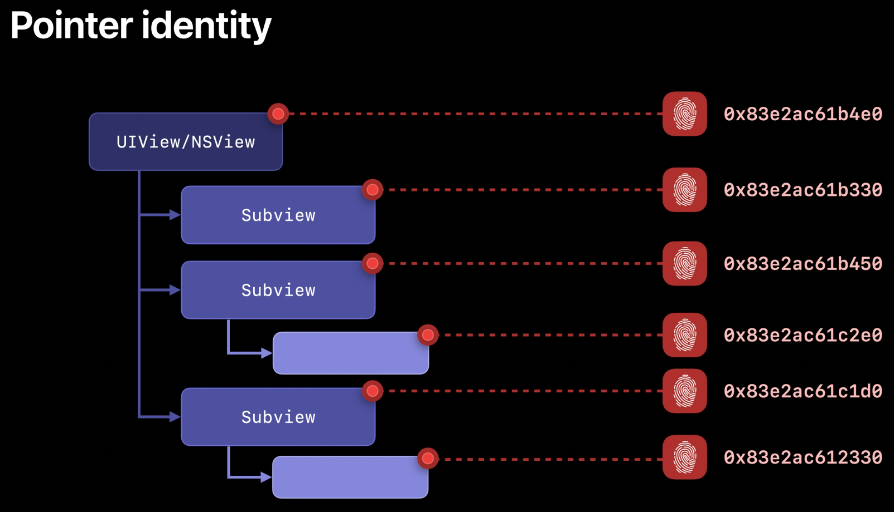
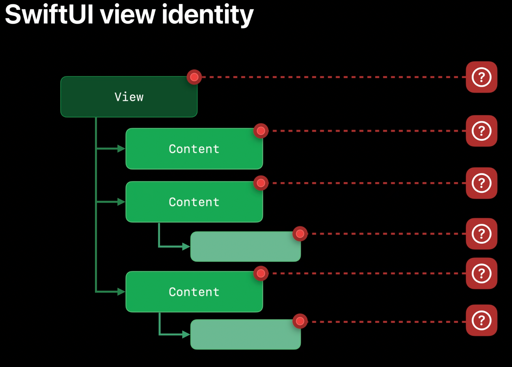

# Declarative UI
## 1. Identity

It's also a critical aspect of how SwiftUI understands your app. 

Views that share the same identity represent different states of the same conceptual UI element.

Same identity = Same element

in contrast;

different identities = distinct elements

>	Every View has an **identity** even if not explicit identity

### Types of identity

#### 1. Explicit identity

Using custom or data-driven identifiers.
	
	
	
Assigning names or identifiers like this is a form of explicit identity.
Explicit identity is powerful and flexible, but does require that someone, somewhere keeps track of all those names.
	

	
>	The pointer is a natural source of explicit identity.


	
But SwiftUI doesn't use pointers because SwiftUI views are value types, commonly represented as structs instead of classes.
- Not allocated, no pointers
- Efficient memory representation
- Supports small, single-purpose components
	
TMI:  `SwiftUI essentials WWDC19`
		
Example for ScrollViewReader with identity; 
	
```swift
ScrollViewReader { proxy in
	ScrollView{
		HeaderView(rescueDog)
			.id (headerID)
		Text(rescueDog.backstory)
		Button("Jump to Top") {
			withAnimation{
				proxy.scrollTo(headerID)
			}
		}
	}
}
```


#### 2. Structural identity

Distinguishing views by their type and position in the view hierarchy.


When SwiftUI looks at your views, it sees their generic types -- in this case, our if statement translated into a _ConditionalContent view, which is generic over its true and false content.
	
This translation is powered by a ViewBuilder, which is a type of result builder in Swift.
	
The View protocol implicitly wraps its body property in a ViewBuilder, which constructs a single generic view from the logic statements in our property.
	
The some View return type of our body property is a placeholder that represents this static composite type, hiding it away so it doesn't clutter up our code.


Using this generic type, SwiftUI can guarantee that the true view will always be the AdoptionDirectory, while the False view will always be the DogList, allowing them to be assigned an implicit, stable identity behind the scenes.


##### Using AnyView

Each conditional branch in the function returns a different kind of view, so I've wrapped them all in AnyViews because Swift requires a single return type for the whole function.

Unfortunately, this also means that SwiftUI can't see the conditional structure of my code.

Instead, it just sees an AnyView as a return type of the function.

This is because AnyView is what's called a "type-erasing wrapper type" -- it hides the type of the view it is wrapping from its generic signature.


To create helper func which is return view, function should return single type of object. To more information [please check the link at time 14:00 ](https://developer.apple.com/wwdc21/10022)


Using AnyView; 

>	In general, we recommend avoiding AnyViews whenever possible. And because AnyView hides static type information from the compiler, it can sometimes prevent helpful diagnostic errors and warnings from being surfaced in your code.

- Makes code harder to understand
- Fewer compile-time diagnostics
- Worse performance when not needed

## 2. Lifetime

View Value != View Identity

Same view but different identity.


When we first evaluate body and we enter the true branch, SwiftUI will allocate persistent storage for the state with its initial value.

Throughout the lifetime of this view, SwiftUI persists the state as it gets mutated by various actions.

But what happens if the value of dayTime changes and we enter the false branch? SwiftUI knows this is a different view with a distinct identity.

It creates new storage for the false view, starting with the state's initial value, and the storage for the true view is deallocated right after.


But what if we go back to the true branch? Well, that's a new view again, so SwiftUI creates new storage, starting again from the state's initial value.

>	State lifetime = View lifetime

##### Examples with foreach


## 3. Dependencies

